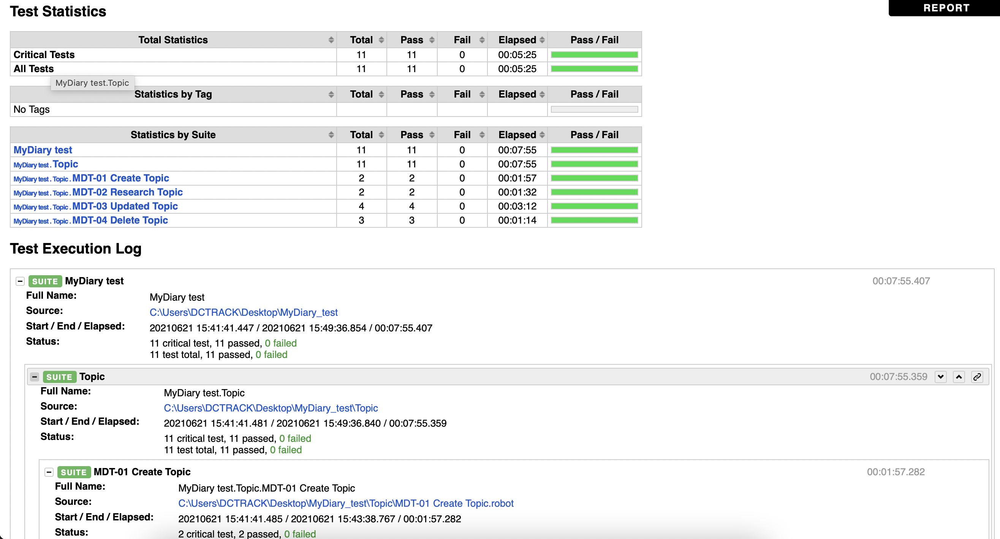

### Summary
Acceptance testing of application "MyDiary" using Robot Framework, Appium and Android Studio.

### Testing tools
- Language:
Robot Framework, Python
- Tool:
Appium
- Environment:
Android Studio

### Test Approach
- 80% code coverage
- 90% of test cases must be passed

### Result Example
